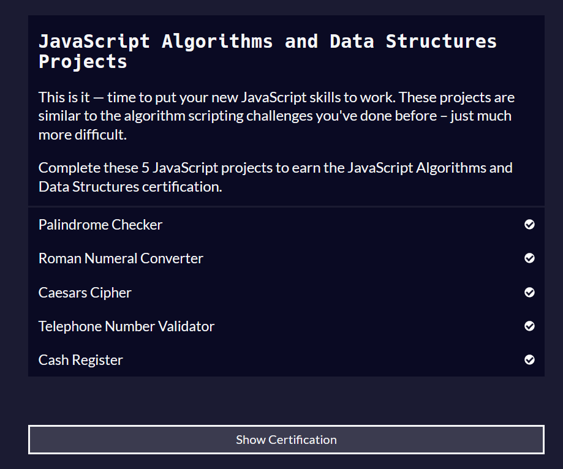

# Desafio 1 - Algoritmos e Lógica de Programação em JavaScript

Este desafio tem como objetivo resolver a última seção “JavaScript Algorithms and Data Structures Projects” do curso da FreeCodeCamp - Algoritmos e estruturas de dados em JavaScript, vocês deverão completar as 5 atividades dessa seção, salvar o código na pasta correta e enviar um print da seção concluída, por exemplo:

> Note que é possível criar um certificado depois de concluir as 5 atividades.

Caso surjam dúvidas, você pode utilizar o canal da capacitação no slack, contatar algum membro ou conversar com seu squad.

Você deve realizar um fork deste repositório para sua conta pessoal no GitHub. A entrega só será considerada válida se estiver incluída em uma release no GitHub. Se o candidato não souber como realizar um Fork, Commit, Push e uma Release no GitHub, deverá pesquisar ou pedir ajuda. O desafio também avaliará sua independência.

Além de de realizar o desafio proposto, o trainee deverá colocar os 5 desafios solucionados no repositório do github que o trainee realizou o fork. Caso o trainee envie o projeto sem as devidas soluções, a entrega será desconsiderada.

## Links Importantes

- Link do FreeCodeCamp:

    https://www.freecodecamp.org/learn/javascript-algorithms-and-data-structures/
    
- Link do repositório com todos os comandos de git e github:

    https://gist.github.com/leocomelli/2545add34e4fec21ec16

- Link do w3school:

    https://www.w3schools.com/js/default.asp

## Entrega

- A entrega do desafio deve ser realizada através de uma Release no GitHub.
  - Crie a release no seu repositório pessoal e envie o zip pelo google classroom.
- O candidato não deve excluir o repositório e nem a release após a entrega, pois a utilização do GitHub será avaliada.# nickby2-Desafio-1-2024.2
# Desafio-1-2024.1-Frontend
